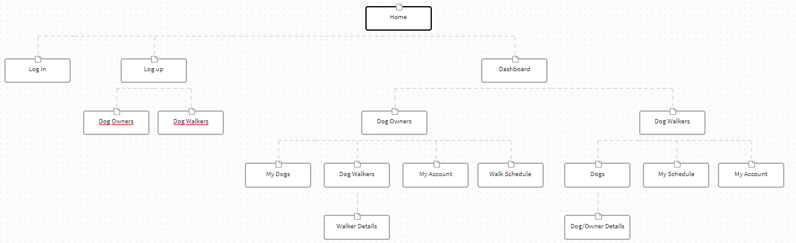
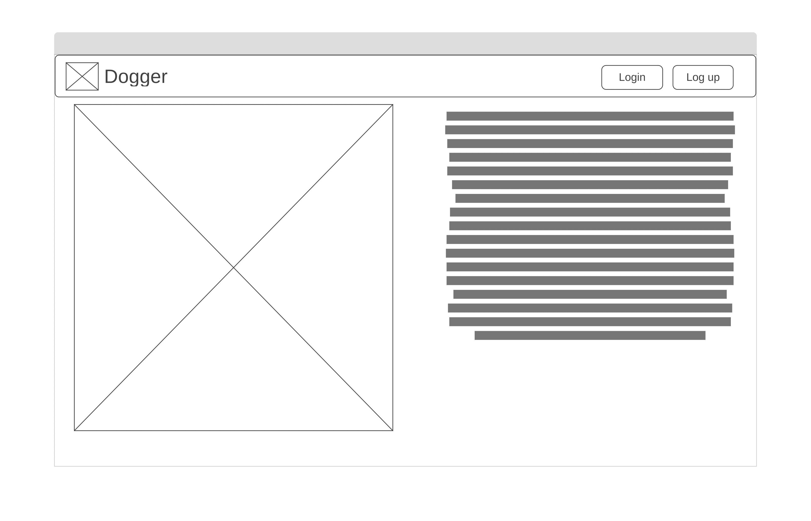
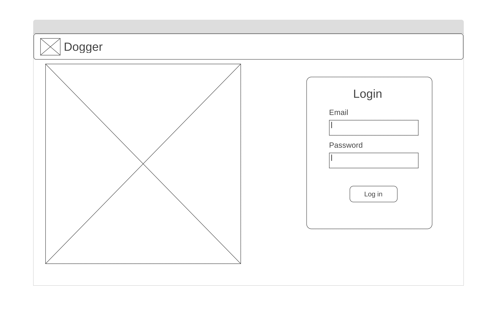
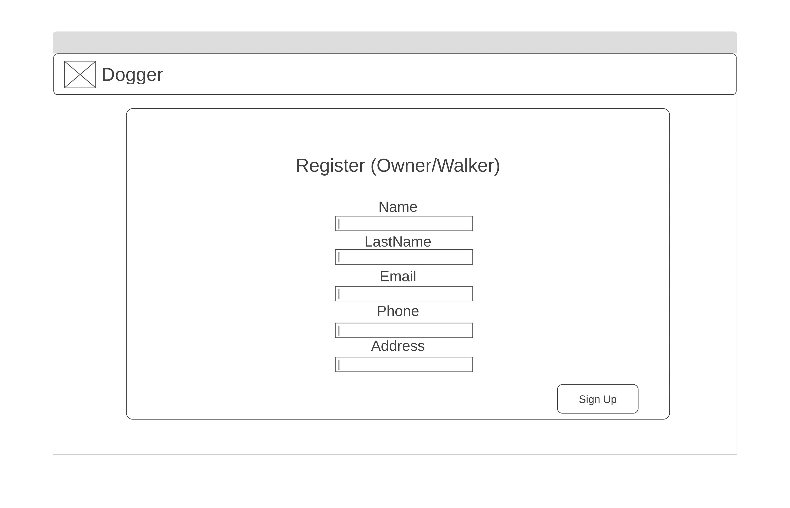
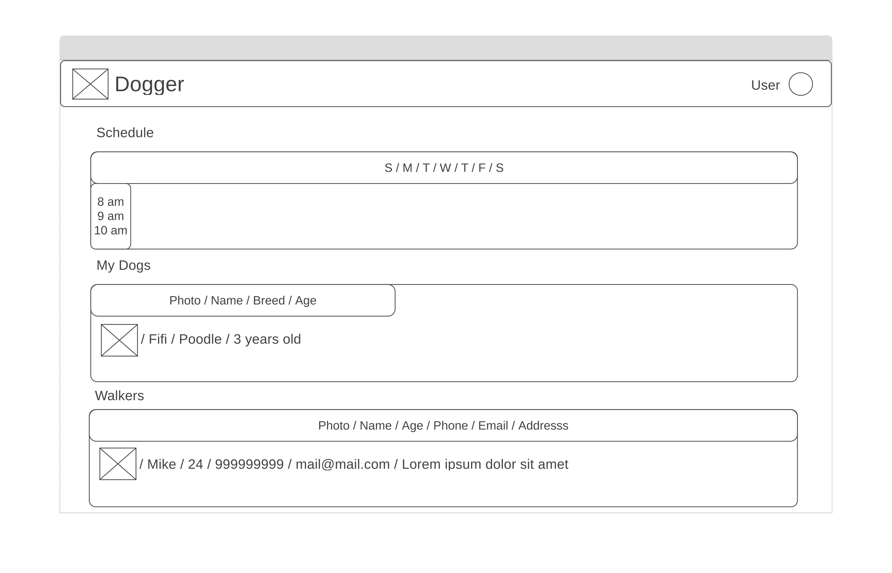
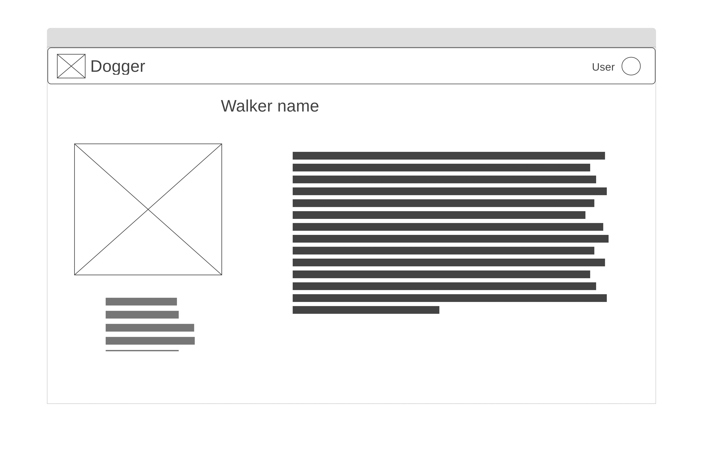
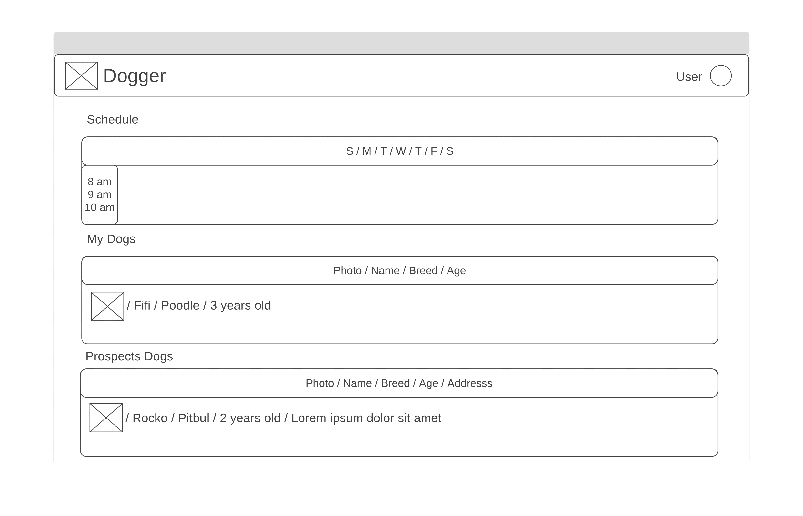
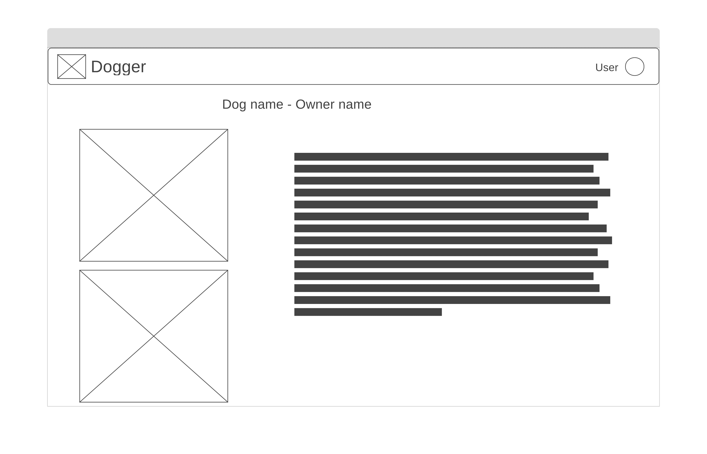
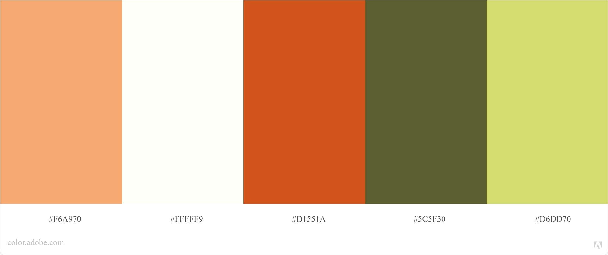

Dogger
===

Dog owners and walkers meetter

### Description
App to connect persons with dogs with anothers who are able to take walks with these dogs.

Development process
---

### Site Map

Web app contains homepage from where users will navigate, on depend if an account is existing, to login or register theirself. After log on, dahsboard will be showen, where users can access to theirs dogs info, owners and walkers info and scheduled walks. Also has an 'My Account' section, where users can see and edit theirs data.

### Wireframes

Wireframes are designed with sitemap as reference, next are shown each view:

#### Homepage

Into home, a navbar is locked at top page where users will found log in or log up buttons. At middle there are the app logo and some text as description, and at bottom the copyrigth label.

#### Log In

Within log in view, the navbar with app title is shown at top. Onto middle, the app logo remains and the log in form is by a side.

#### Log Up

Log up view is created to give users where register himself. In other hand respect to login page, here there is not the app logo at middle, only the register form, to get user attention to each input there.

#### Dashboard

To dashboard, two design has been created, one to owners and another to walkers, these are very similar, but some data shown would be different.

###### Owners

Owners can see a graph where walks scheduled are shown and are able to be edited. Below, there is a table with information of every dog. At bottom, there is another table with information of every walker near. Tables have actions to show item details:

###### Walkers

Walkers can see a graph where walks scheduled are shown and are able to be edited. Below, there is a table with information of every dog that has assigned. At bottom, there is another table of every dog that has requested be walked by him. Tables have actions to show item details:

#### My Account

Every user has a 'My Account' view, where his info is shown and can be edited, o delete his account.

### Colors Palete

Keep in mind some data about pshycology of colors, this palete has been selected: 
- #5C5F30 as primary and dark color
- #D6DD70 as secondary
- #F6A970 as info color
- #FFFFF9 as light color
- #D1551A as error/warning color

Both frameworks initial docs are found here:
- [ReactJS](./README-rj.md)
- [Django](./README-django.md)
